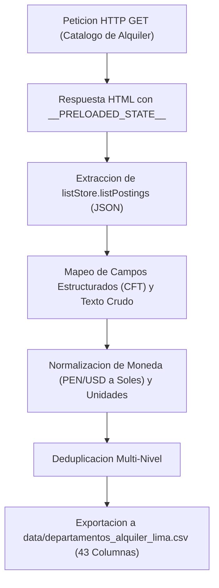

# Protocolo y Metodologia de Adquisicion de Datos

## 1. Resumen y Fuentes de Informacion

Este documento describe los procesos de adquisicion y procesamiento de datos para la construccion de dos fuentes principales:

1. **Dataset Microinmobiliario de Alquileres (`departamentos_alquiler_lima.csv`)**: Recopila anuncios de departamentos en modalidad exclusiva de **Alquiler** en Lima Metropolitana.
   * **Adondevivir** (`https://www.adondevivir.com`)
   * **Urbania Peru** (`https://urbania.pe`)
   * Total consolidado: **3,822 departamentos unicos**.

2. **Dataset Macroinmobiliario Panel BCRP (`dataset_alquileres_trimestre_bcrp.csv`)**: Series temporales macroeconomicas e inmobiliarias trimestrales (T3-2013 a T1-2026) obtenidas de la API oficial del **Banco Central de Reserva del Peru (BCRP)**.
   * Total consolidado: **663 observaciones** (51 trimestres por 13 distritos/categorias).

3. **Dataset de Transporte Publico Oficial (`paraderos.csv`)**: Inventario de paraderos georreferenciados de Lima Metropolitana y Callao publicado originalmente por la **Autoridad de Transporte Urbano para Lima y Callao (ATU)** (corte temporal: mayo 2021) y preservado en un repositorio de respaldo de datos abiertos en GitHub (`jmcastagnetto/lima-atu-covid19-paraderos`) tras la desactivacion de la consulta publica directa en el portal institucional.
   * Total consolidado: **3,233 paraderos unicos** georreferenciados en 43 distritos.

---

## 2. Adquisicion de Datos de Portales Inmobiliarios

### 2.1. Arquitectura de Scraping
Ambos portales operan sobre la infraestructura de Navent, la cual incluye el estado inicial de la aplicacion en el HTML renderizado en servidor (*Server-Side Rendering*) dentro de la variable global `window.__PRELOADED_STATE__`.

### 2.2. Mapeo de Campos Estructurados (CFT)
La extraccion prioriza los campos nativos de la base de datos JSON del portal:
* `CFT100`: Area total ($m^2$) $\rightarrow$ `area_total`
* `CFT101`: Area construida ($m^2$) $\rightarrow$ `area_construida`
* `CFT2`: Dormitorios $\rightarrow$ `dormitorios`
* `CFT3`: Banos $\rightarrow$ `banos`
* `CFT4`: Medios Banos $\rightarrow$ `medios_banos`
* `CFT7`: Estacionamientos $\rightarrow$ `estacionamientos`
* `CFT5`: Antiguedad en anos $\rightarrow$ `antiguedad`
* Precios, expensas de mantenimiento, ubicacion, coordenadas geograficas, texto crudo para NLP (`texto_amenidades_crudo`) y amenidades para imputacion en EDA.

### 2.3. Control de Tasa y Resiliencia
* Encabezados de navegacion estandarizados (*User-Agent*).
* Pausas de 1.0 a 1.3 segundos entre solicitudes.
* Reintentos automaticos con backoff exponencial ante respuestas HTTP no exitosas.

---

## 3. Adquisicion de Series Temporales desde la API del BCRP

### 3.1. Consulta a la API JSON
Se consume el endpoint oficial sin requerir web scraping:
`https://estadisticas.bcrp.gob.pe/estadisticas/series/api/[codigos_serie]/json/[periodo_inicio]/[periodo_fin]`

### 3.2. Series Consultadas (T3-2013 a T1-2026)
1. **Indicador PER (Precio de Venta / Alquiler Anual) — 13 series trimestrales**:
   * Barranco (`PD41940PQ`), Jesus Maria (`PD41941PQ`), La Molina (`PD41942PQ`), Lince (`PD41943PQ`), Magdalena (`PD41944PQ`), Miraflores (`PD41945PQ`), Pueblo Libre (`PD41946PQ`), San Borja (`PD41947PQ`), San Isidro (`PD41948PQ`), San Miguel (`PD41949PQ`), Surco (`PD41950PQ`), Surquillo (`PD41951PQ`), Promedio (`PD41952PQ`).
2. **Precio de Venta de Departamentos (US$ corrientes por $m^2$) — 13 series trimestrales**:
   * Barranco (`PD37957PQ`), Jesus Maria (`PD17464PQ`), La Molina (`PD17459PQ`), Lince (`PD17465PQ`), Magdalena (`PD17466PQ`), Miraflores (`PD17460PQ`), Pueblo Libre (`PD17467PQ`), San Borja (`PD17461PQ`), San Isidro (`PD17462PQ`), San Miguel (`PD17468PQ`), Surco (`PD17463PQ`), Surquillo (`PD37958PQ`), Promedio (`PD37944PQ`).
3. **Tipo de Cambio Nominal Promedio (`PN01246PM`) — Serie mensual**:
   * Descarga mensual agregada a nivel trimestral mediante promedio aritmetico de los meses de cada trimestre calendario.

### 3.3. Estandarizacion Temporal y Estructura Panel
* Conversion de identificadores temporales (`T3.13` $\rightarrow$ `2013-T3`).
* Cruce por llaves `(Trimestre, Distrito)` para conformar una estructura panel balanceada.
* Imputacion de valores faltantes puntuales mediante interpolacion lineal dentro de cada serie distrital.
---

## 4. Adquisicion del Dataset de Paraderos Oficiales de la ATU

### 4.1. Extraccion, Origen y Trazabilidad
Los datos corresponden al inventario georreferenciado oficial publicado por la ATU en su aplicativo institucional (`sistemas.atu.gob.pe/paraderosCOVID`) con corte temporal a mayo de 2021. Debido a que el acceso publico directo a dicho aplicativo fue restringido al concluir la emergencia sanitaria, la informacion se recupera a traves del repositorio de respaldo de datos abiertos en GitHub de Jesus M. Castagnetto (`jmcastagnetto/lima-atu-covid19-paraderos`), el cual conserva una copia integra y fidedigna del archivo oficial original.
* **Entidad emisora original**: Autoridad de Transporte Urbano para Lima y Callao (ATU).
* **Repositorio de respaldo / espejo**: GitHub (`lima-atu-covid19-paraderos`).
* **Corte temporal de la data**: Mayo 2021.
* **Sistema de Coordenadas**: WGS84 (EPSG:4326) en grados decimales.

### 4.2. Procesamiento y Estandarizacion
1. **Generacion de Identificador Unico**: Asignacion de clave primaria estructurada `paradero_id` (`ATU_PAR_0001` a `ATU_PAR_3233`).
2. **Normalizacion Geografica**: Validacion de rangos de latitud y longitud dentro del poligono metropolitano de Lima y Callao.
3. **Mapeo de Atributos Operativos**: Estandarizacion de campos institucionales:
   * `parnom` -> `nombre_paradero`
   * `disnom` -> `distrito`
   * `cornom` -> `corredor_vial`
   * `tipodet` -> `tipo_transporte` (*Transporte Regular*, *Alimentador*, *Corredor*, *Troncal*)
   * `nivel` / `nivel_lbl` -> `nivel_afluencia_cod` / `nivel_afluencia_desc` (*Moderado*, *Alto*, *Muy Alto*, *Extremo*)
   * `ts` -> `timestamp_oficial`
4. **Exportacion**: Almacenamiento directo en `data/paraderos.csv` con codificacion UTF-8 sin perdida de precision decimal.
